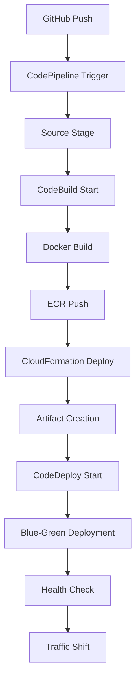

# CI/CD Pipeline Technical Reference

This document provides technical details about the CI/CD pipeline implementation and pipeline-specific configurations.

## Pipeline Architecture

The application uses a three-stage CodePipeline:

1. **Source Stage**: GitHub integration via CodeStar connection
2. **Build Stage**: CodeBuild project for Docker image creation and infrastructure deployment
3. **Deploy Stage**: CodeDeploy ECS blue-green deployment

## Critical Technical Requirements

### Container Configuration Standards

1. **Container Naming Convention**:
   - Main container name: same as `ProjectName` (e.g., `my-app`)
   - Scheduled task container name: `${ProjectName}-scheduled` (when enabled)
   - Must be consistent across `taskdef.json`, `appspec.yaml`, and pipeline configuration

2. **Image Placeholder Format**:
   - Task definition template: `<IMAGE1_NAME>` (single angle brackets)
   - AppSpec template: `<TASK_DEFINITION>` (single angle brackets)
   - CodeDeploy Image1ContainerName parameter: `IMAGE1_NAME`

3. **Artifact File Requirements**:
   - Image detail file: `imageDetail.json` (exact name required by CodeDeploy)
   - Format: `{"ImageURI":"<ecr-repository-uri>:<tag>"}`
   - Task definition template: `taskdef.json`
   - AppSpec template: `appspec.yaml`

### Build Process Details

#### Docker Image Build
```bash
# ECR login
aws ecr get-login-password --region $AWS_REGION | docker login --username AWS --password-stdin $ECR_REPOSITORY_URI

# Image tagging strategy
COMMIT_HASH=$(echo $CODEBUILD_RESOLVED_SOURCE_VERSION | cut -c 1-7)
IMAGE_TAG=${COMMIT_HASH:=latest}

# Build and tag
docker build -t $ECR_REPOSITORY_URI:latest .
docker tag $ECR_REPOSITORY_URI:latest $ECR_REPOSITORY_URI:$IMAGE_TAG
```

#### Infrastructure Deployment
The build stage also handles CloudFormation stack updates:
```bash
aws cloudformation deploy \
  --template-file infra/aws/cloudformation.yaml \
  --stack-name my-app \
  --parameter-overrides \
    ProjectName=my-app \
    SkipECRCreation=true \
    CreateCodeDeployApp=false \
    CreateCloudFrontDistributions=false \
    KeepExistingCloudFront=true \
  --capabilities CAPABILITY_IAM CAPABILITY_NAMED_IAM \
  --no-fail-on-empty-changeset
```

## Pipeline Permissions Model

### CodeBuild Service Role Permissions

The CodeBuild service role requires comprehensive permissions for:

#### Core Infrastructure
- **CloudFormation**: Stack management and resource deployment
- **ECS**: Task definition registration and service management
- **ECR**: Container image management
- **IAM**: Role creation and management for ECS tasks

#### Scheduled Task Resources (when `CreateScheduledTask=true`)
- **EventBridge**: Rule creation and target management
- **CloudWatch**: Alarm creation and log group management
- **SNS**: Topic creation for failure notifications

#### Blue-Green Deployment
- **CodeDeploy**: Application and deployment group management
- **Load Balancer**: Target group and listener management

### Task Execution Flow



## Environment-Specific Configurations

### Development vs Production

The pipeline supports different deployment patterns:

#### Development
- Direct ECS service updates
- Faster deployment cycle
- Minimal health check requirements

#### Production
- Blue-green deployment with CodeDeploy
- Extended health check periods
- Automatic rollback on failure

### Branch Strategy

- **main**: Production releases
- **develop**: Staging/pre-production deployments
- **feature/***: Manual deployment trigger only

## Pipeline Monitoring

### CodePipeline Metrics
- Execution frequency and duration
- Stage success/failure rates
- Deployment lead time

### CodeBuild Metrics
- Build duration and success rate
- Docker image size and build time
- Infrastructure deployment time

### CodeDeploy Metrics
- Deployment success rate
- Rollback frequency
- Traffic shift duration

## Advanced Configuration

### Custom Build Environment Variables

```yaml
Environment:
  Type: LINUX_CONTAINER
  ComputeType: BUILD_GENERAL1_SMALL
  Image: aws/codebuild/amazonlinux2-x86_64-standard:5.0
  PrivilegedMode: true
  EnvironmentVariables:
    - Name: AWS_ACCOUNT_ID
      Value: !Ref AWS::AccountId
    - Name: AWS_REGION
      Value: !Ref AWS::Region
    - Name: ECR_REPOSITORY_URI
      Value: !Sub ${AWS::AccountId}.dkr.ecr.${AWS::Region}.amazonaws.com/${ProjectName}
```

### Blue-Green Deployment Configuration

```yaml
Deploy:
  Actions:
    - Name: DeployToECS
      ActionTypeId:
        Category: Deploy
        Owner: AWS
        Provider: CodeDeployToECS
        Version: '1'
      Configuration:
        ApplicationName: !Sub ${ApplicationStackName}-app
        DeploymentGroupName: !Sub ${ApplicationStackName}-dg
        TaskDefinitionTemplateArtifact: BuildOutput
        TaskDefinitionTemplatePath: taskdef.json
        AppSpecTemplateArtifact: BuildOutput
        AppSpecTemplatePath: appspec.yaml
        Image1ArtifactName: BuildOutput
        Image1ContainerName: IMAGE1_NAME
```

## Troubleshooting Pipeline-Specific Issues

### Build Stage Failures

#### Docker Build Issues
```bash
# Check Docker daemon status
docker info

# Verify ECR permissions
aws ecr describe-repositories --repository-names my-app

# Test ECR login
aws ecr get-login-password --region us-east-1 | docker login --username AWS --password-stdin <ACCOUNT_ID>.dkr.ecr.us-east-1.amazonaws.com
```

#### CloudFormation Deployment Failures
```bash
# Check stack events
aws cloudformation describe-stack-events --stack-name my-app

# Validate template
aws cloudformation validate-template --template-body file://cloudformation.yaml
```

### Deploy Stage Failures

#### CodeDeploy Configuration Issues
```bash
# Check deployment status
aws deploy get-deployment --deployment-id d-XXXXXXXXX

# Verify task definition
aws ecs describe-task-definition --task-definition my-app:REVISION

# Check service events
aws ecs describe-services --cluster my-app-cluster --services my-app-service
```

#### Image Artifact Issues
- Verify `imageDetail.json` contains correct ECR URI
- Check that container name matches across all configuration files
- Ensure image exists in ECR repository

## Performance Optimization

### Build Time Optimization
- Use Docker layer caching where possible
- Optimize Dockerfile for minimal layers
- Use multi-stage builds for smaller final images

### Deployment Speed
- Optimize health check intervals
- Use appropriate deployment configuration for environment
- Monitor and adjust timeout values

This technical reference complements the general deployment documentation and provides pipeline-specific implementation details.
